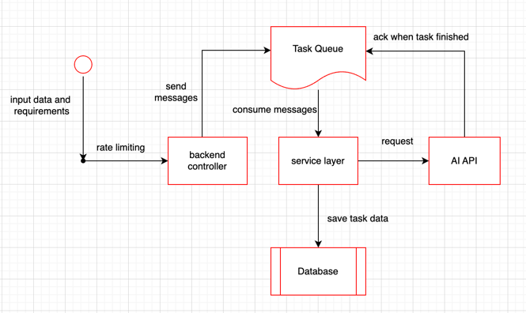
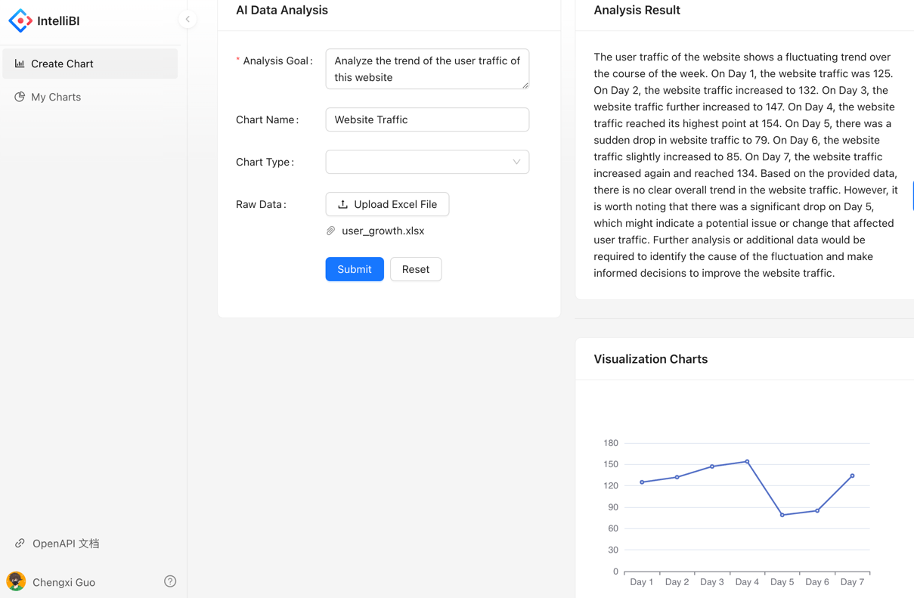
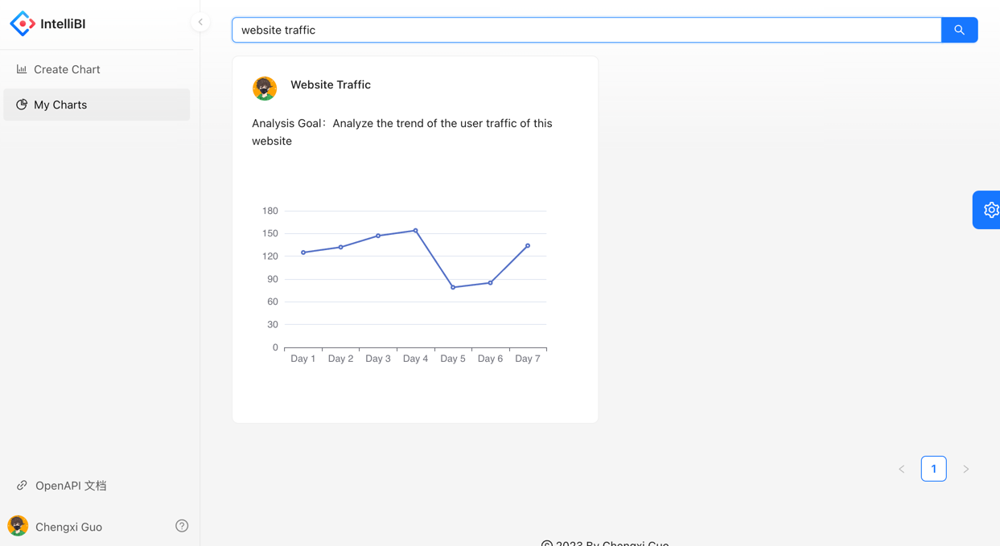

# IntelliBI: AIGC Data Analysis Platform

## Introduction

This is an AI-assisted data analysis web platform developed by **SpringBoot**
and **React**. The platform aims at providing comprehensive data analysis
results for non-professionals. Given raw excel dataset and analysis goal, the system 
auto-generates analytical results and visualization charts.

For frontend, we used **ant design pro** for UI solution; for backend, 
we used **MySQL** for database, **Redis** for rate limiting and **RabbitMQ** 
for MQ. 

## Workflow Diagram

## Demo

